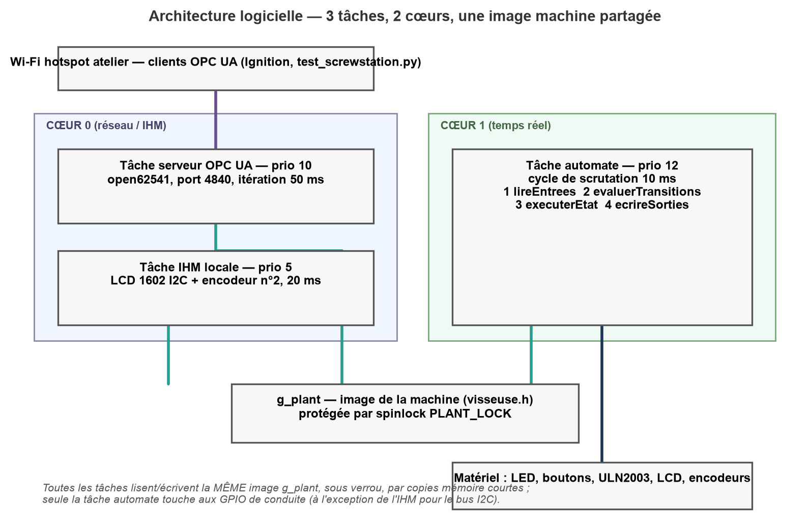

# 🏗️ Architecture du projet

[🏠 Accueil](../README.md) · [📖 Sommaire](README.md) · [🔌 Montage](montage.md) · [📶 Wi-Fi](wifi.md) · [🔗 OPC UA](opcua.md)

Cette page explique **comment le code est organisé**, **quelles tâches tournent**
sur le processeur et **comment les données circulent** entre elles.



---

## 1. Arborescence du code

```text
include/                          src/
├── config.h                      ├── main.cpp
├── opcua_object.h                ├── config.cpp
├── devices/                      ├── devices/
│   ├── screwstation.h            │   ├── screwstation.cpp
│   ├── machine.h                 │   ├── rc522.cpp
│   ├── rc522.h                   │   └── local_hmi.cpp
│   └── local_hmi.h               └── services/
└── services/                         ├── opcua_server.cpp
    ├── opcua_server.h                └── wifi_manager.cpp
    └── wifi_manager.h
```

| Élément | Rôle |
|---|---|
| `config.h` / `config.cpp` | Constantes globales (Wi-Fi, OPC UA, temps) — **point de configuration** |
| `opcua_object.h` | Modèle générique `OpcUaObject` / `OpcUaProperty` |
| `services/` | Briques transverses : serveur OPC UA générique, gestion Wi-Fi |
| `devices/` | Tout ce qui est propre à la machine : automate, RFID, IHM |

### Le pattern « device »

Chaque périphérique suit toujours le même contrat, ce qui permet de l'ajouter ou
de le retirer sans toucher au reste :

```cpp
void       <device>_init();          // initialise le matériel / lance ses tâches
OpcUaObject <device>_get_object();   // décrit ses variables pour OPC UA
```

Dans `setup()` (`src/main.cpp`), on initialise les devices puis on passe le
tableau de leurs objets au serveur :

```cpp
wifi_init();
screwstation_init();

OpcUaObject devices[] = {
    screwstation_get_object(),
};
opcua_server_start_task(devices, sizeof(devices) / sizeof(devices[0]));
```

> Pour ajouter un nouveau périphérique, il suffit de créer un couple
> `include/devices/<nom>.h` + `src/devices/<nom>.cpp` respectant ce contrat et de
> l'ajouter au tableau `devices[]`.

Le device `screwstation` s'appuie sur deux modules internes du dossier
`devices/` : `rc522.cpp` (lecteur RFID) et `local_hmi.cpp` (LCD + encodeur).

---

## 2. Tâches FreeRTOS

| Tâche | Cœur | Priorité | Période | Fichier | Rôle |
|---|---|---|---|---|---|
| Automate | **1** | 12 | 10 ms | `screwstation.cpp` | Cycle de scrutation en 4 phases |
| Serveur OPC UA | **1** | 1 | ~10 ms + refresh 2 s | `opcua_server.cpp` | open62541, port 4840 |
| IHM locale | **0** | 5 | 20 ms | `local_hmi.cpp` | LCD 1602 + encodeur, 6 écrans |
| `loop()` Arduino | 1 | 1 | 1 s | `main.cpp` | Relance le watchdog |
| Pile Wi-Fi / lwIP | 0 | (système) | — | core ESP-IDF | Réseau |

Points importants :

- **L'automate ne dépend ni du Wi-Fi ni d'OPC UA** : la machine vit même sans
  réseau. C'est le principe même d'un automate.
- La tâche **IHM est indépendante** et de priorité basse : les ~30 ms d'un
  rafraîchissement LCD ne retardent jamais le cycle de scrutation.
- L'automate et le serveur OPC UA partagent le **cœur 1** ; comme l'automate
  dort 10 ms entre chaque cycle, le serveur s'exécute pendant ces intervalles.

---

## 3. Cycle de scrutation de l'automate (4 phases, 10 ms)

```text
boucle infinie (toutes les 10 ms) :
    1. lireEntrees()        — image mémoire des entrées (boutons, Cmd OPC UA, RFID)
    2. evaluerTransitions() — la machine à états décide
    3. executerEtat()       — actions de l'état courant (indexage, contrôle…)
    4. ecrireSorties()      — image mémoire des sorties (LED, moteur pas-à-pas)
```

- **8 états** : INIT → ARRÊT → PRÊT → ATTENTE_COMPOSANT → VISSAGE → FIN_CYCLE,
  avec SUSPENDU et DÉFAUT en aparté.
- Chaque pied traverse **INDEXAGE → SERRAGE → CONTRÔLE**.
- Aucun `delay()` bloquant : les durées sont des comparaisons d'horloge
  (`esp_timer_get_time()`).

---

## 4. Flux de données : l'image machine `g_plant`

Toutes les tâches partagent **une seule structure**, `plant_t g_plant`, définie
dans [`include/devices/machine.h`](../include/devices/machine.h). C'est
l'« image mémoire » de la machine, équivalent de la mémoire d'un automate.

```text
                 ┌────────────────────────┐
   Automate ────►│                        │◄──── IHM locale
   (cœur 1)      │      g_plant           │      (cœur 0)
                 │   (état complet)       │
   OPC UA  ◄─────┤                        │
   (cœur 1)      └────────────────────────┘
                     protégé par g_plant_mux
```

- L'**automate** écrit `g_plant` (états, compteurs, angles, badge…).
- L'**IHM** lit `g_plant` et écrit les *Settings*.
- Le **serveur OPC UA** lit `g_plant` directement (DataSource) et écrit les
  commandes / réglages.

### La règle des sections critiques

L'accès concurrent entre cœurs est protégé par un **spinlock** :

```cpp
#define PLANT_LOCK()   taskENTER_CRITICAL(&g_plant_mux)
#define PLANT_UNLOCK() taskEXIT_CRITICAL(&g_plant_mux)
```

> **Règle d'or** : entre `PLANT_LOCK()` et `PLANT_UNLOCK()`, uniquement des
> lectures/copies mémoire. **Jamais** d'appel pouvant prendre un verrou
> (`printf`/`snprintf`, `time`/`localtime`, `malloc`…), sous peine d'`abort()`.
> **Formater avant, copier sous le verrou.**

---

## 5. Séquence de démarrage

1. `Serial.begin(115200)` puis bref délai.
2. `wifi_init()` → connexion au réseau (voir [Wi-Fi](wifi.md)).
3. `screwstation_init()` :
   - initialise l'image machine `g_plant` avec les valeurs par défaut ;
   - démarre l'horloge SNTP (`pool.ntp.org`) pour l'horodatage des cycles ;
   - crée la **tâche automate** (cœur 1) et la **tâche IHM** (cœur 0).
4. Construction du tableau `devices[]`.
5. `opcua_server_start_task()` → création de la tâche serveur OPC UA.

---

## 6. Pour aller plus loin

- Détail de la connexion réseau : [Wi-Fi](wifi.md)
- Détail du serveur et de l'arbre d'adressage : [OPC UA](opcua.md)
- Rapport de génération de la bibliothèque : [`rapport-open62541-esp32.md`](rapport-open62541-esp32.md)

---

[🏠 Accueil](../README.md) · [📖 Sommaire](README.md) · [🔌 Montage](montage.md) · [📶 Wi-Fi](wifi.md) · [🔗 OPC UA](opcua.md)
