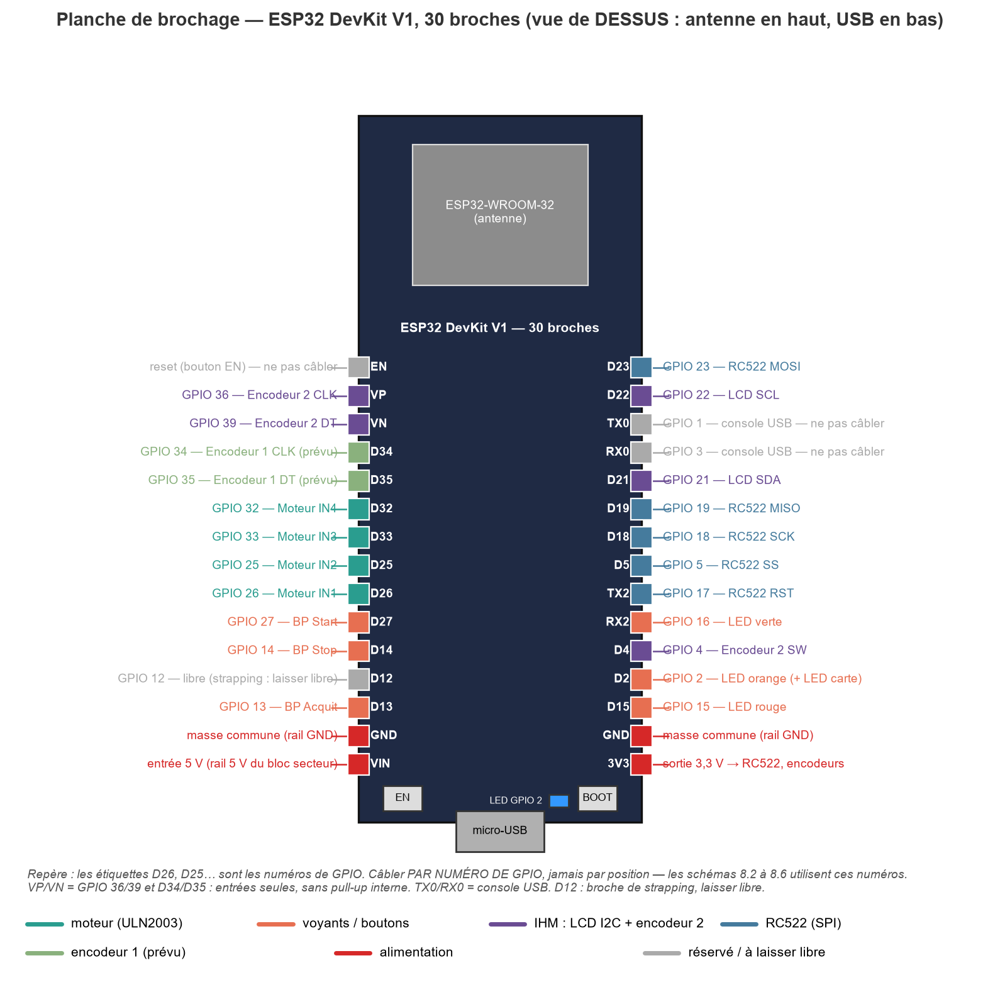
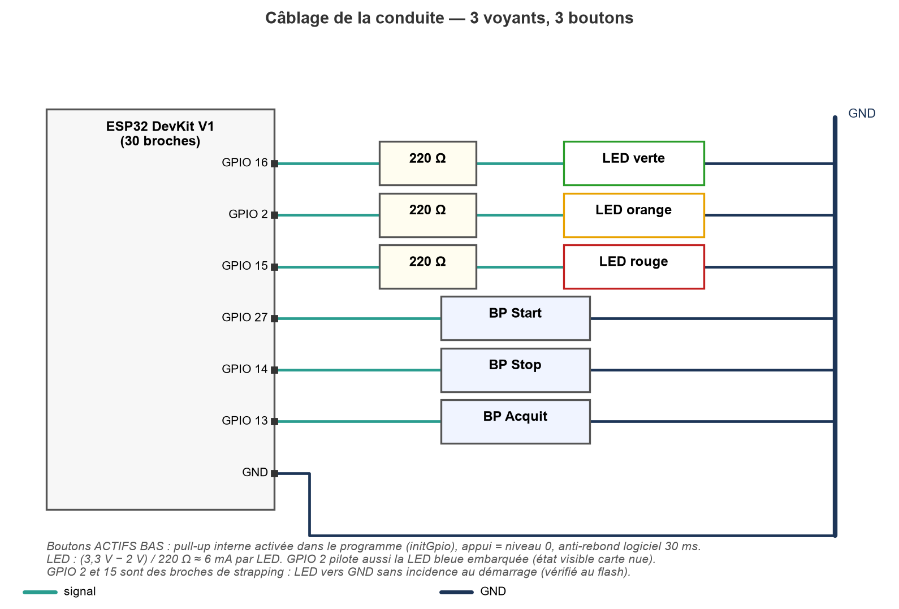
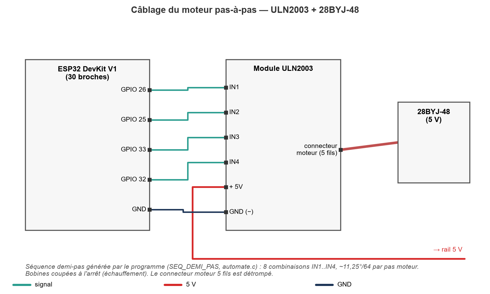
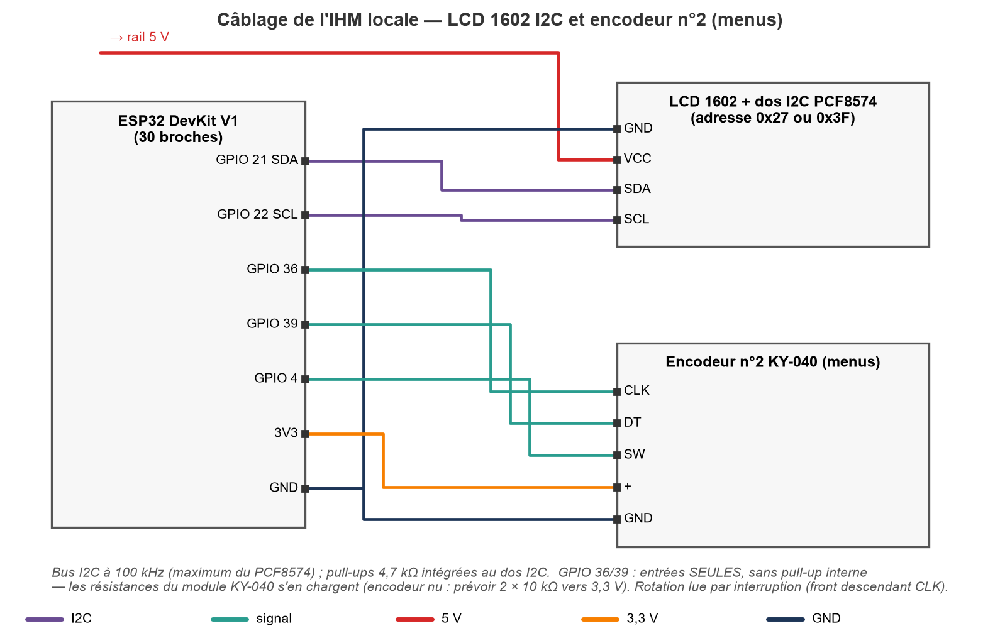
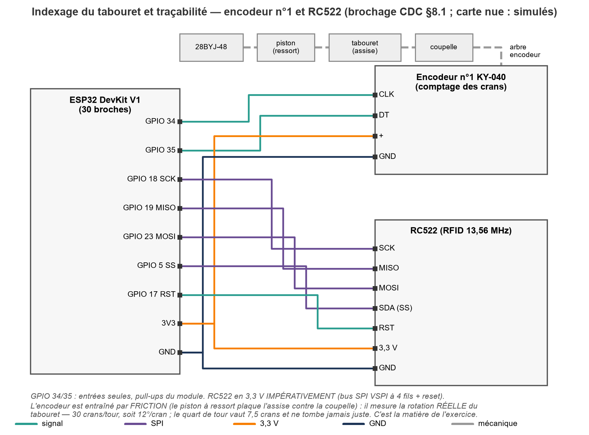
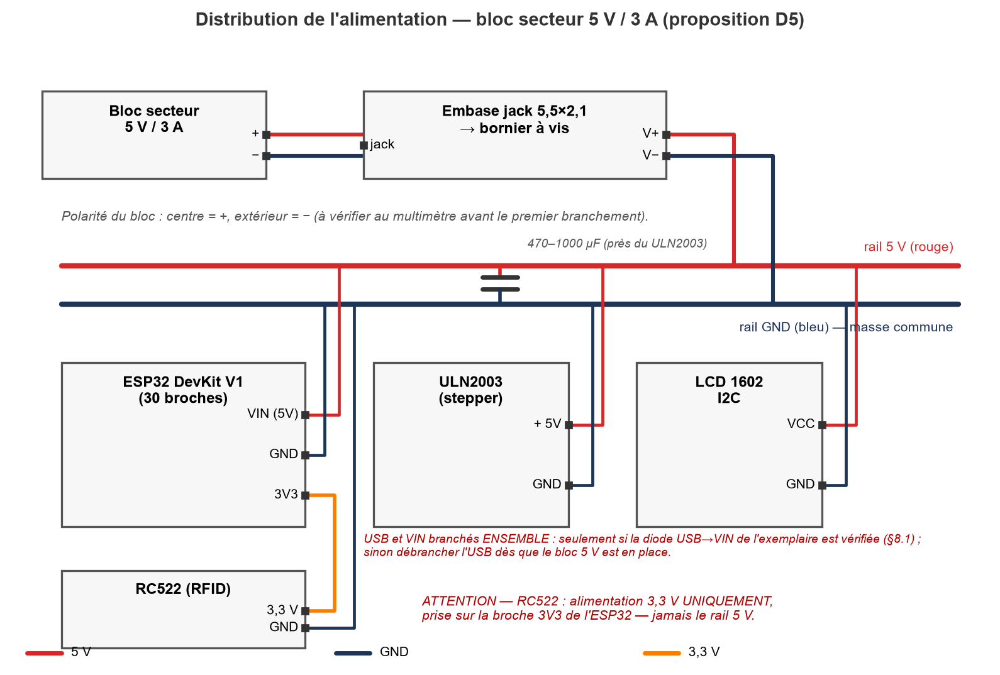

# 🔌 Montage et câblage

[🏠 Accueil](../README.md) · [📖 Sommaire](README.md) · [🏗️ Architecture](architecture.md) · [📶 Wi-Fi](wifi.md) · [🔗 OPC UA](opcua.md)

Cette page décrit **quel composant brancher sur quelle broche** de l'ESP32, et
les **résistances** éventuelles. Le câblage est identique que la carte soit nue
(mode simulation) ou entièrement équipée : le firmware détecte l'absence de
certains composants et bascule alors en simulation.

> La source de vérité du brochage est le fichier
> [`include/devices/machine.h`](../include/devices/machine.h) (`#define PIN_*`).
> Toute modification du câblage doit y être reportée.

---

## ⚠️ Avertissements de sécurité

- **Câbler hors tension** : débranchez l'USB *et* l'alimentation 5 V avant toute
  modification.
- Le **RC522 est alimenté en 3,3 V uniquement** — jamais sur le rail 5 V, sous
  peine de destruction.
- **Toutes les masses doivent être communes** (ESP32, ULN2003, alimentation).
- **GPIO 34 à 39** sont des entrées seules, **sans résistance de tirage
  interne**. Un composant sur ces broches ne peut pas activer de pull-up interne.
- **GPIO 2 et 15** sont des broches de *strapping* (lues au démarrage). Les LED y
  sont câblées vers la masse, ce qui est sans incidence au boot.
- **GPIO 1 (TX0) et GPIO 3 (RX0)** servent à la console USB : à laisser libres.

---

## 1. Tableau de correspondance des broches

Câblez **par numéro de GPIO** (le firmware utilise les numéros, pas la position
sur la carte).

| Fonction | GPIO | Composant / signal | Sens | Remarque |
|---|---|---|---|---|
| Moteur IN1 | **26** | ULN2003 IN1 | Sortie | Bobine 1 du 28BYJ-48 |
| Moteur IN2 | **25** | ULN2003 IN2 | Sortie | Bobine 2 |
| Moteur IN3 | **33** | ULN2003 IN3 | Sortie | Bobine 3 |
| Moteur IN4 | **32** | ULN2003 IN4 | Sortie | Bobine 4 |
| LED verte | **16** | LED + résistance | Sortie | État « production OK » |
| LED orange | **2** | LED + résistance | Sortie | Aussi **LED bleue embarquée** : état visible carte nue |
| LED rouge | **15** | LED + résistance | Sortie | État « DÉFAUT » |
| Bouton Start | **27** | Bouton poussoir | Entrée | Pull-up interne, actif bas |
| Bouton Stop | **14** | Bouton poussoir | Entrée | Pull-up interne, actif bas |
| Bouton Acquit | **13** | Bouton poussoir | Entrée | Pull-up interne, actif bas |
| LCD SDA | **21** | Dos I2C (PCF8574) | Bidirectionnel | Adresse 0x27 puis 0x3F |
| LCD SCL | **22** | Dos I2C (PCF8574) | Sortie | 100 kHz |
| Encodeur n°2 CLK | **36** | KY-040 CLK | Entrée | GPIO entrée seule (pas de pull-up interne) |
| Encodeur n°2 DT | **39** | KY-040 DT | Entrée | GPIO entrée seule |
| Encodeur n°2 SW | **4** | KY-040 bouton | Entrée | Pull-up interne, actif bas |
| RFID SCK | **18** | RC522 SCK | Sortie | Bus SPI VSPI |
| RFID MISO | **19** | RC522 MISO | Entrée | Bus SPI VSPI |
| RFID MOSI | **23** | RC522 MOSI | Sortie | Bus SPI VSPI |
| RFID SS | **5** | RC522 SDA/SS | Sortie | Chip select |
| RFID RST | **17** | RC522 RST | Sortie | Reset matériel |
| Encodeur n°1 CLK | **34** | Encodeur d'axe | Entrée | **Prévu, non codé** (position simulée) |
| Encodeur n°1 DT | **35** | Encodeur d'axe | Entrée | **Prévu, non codé** |

---

## 2. Planche de brochage

---

## 3. Détail par composant

### 3.1 Voyants (3 LED)

| LED | GPIO | Anode (via résistance) | Cathode |
|---|---|---|---|
| Verte | 16 | GPIO 16 | GND |
| Orange / bleue | 2 | GPIO 2 | GND |
| Rouge | 15 | GPIO 15 | GND |

- **Résistance : 220 Ω en série** avec chaque LED (montage : `GPIO → 220 Ω →
  anode LED → cathode → GND`). Adaptez entre **220 Ω et 330 Ω** selon la
  luminosité souhaitée.
- La **LED bleue déjà présente sur la carte** est reliée au GPIO 2 : elle suit la
  LED orange, ce qui permet de voir l'automate vivre sans aucun câblage.

### 3.2 Boutons (Start / Stop / Acquit)

| Bouton | GPIO |
|---|---|
| Start | 27 |
| Stop | 14 |
| Acquit | 13 |

- Câblage : `GPIO → bouton → GND`.
- **Aucune résistance externe nécessaire** : les pull-ups internes de l'ESP32 sont
  activés (`INPUT_PULLUP`), boutons **actifs bas**. Un **anti-rebond logiciel de
  30 ms** est déjà implémenté dans le firmware.
- Optionnel : une **résistance externe de 10 kΩ** vers 3,3 V si vous préférez ne
  pas dépendre du pull-up interne.

### 3.3 Moteur pas-à-pas (28BYJ-48 + ULN2003)

| Signal | GPIO |
|---|---|
| IN1 | 26 |
| IN2 | 25 |
| IN3 | 33 |
| IN4 | 32 |

- Le module ULN2003 se raccorde au **5 V** (rail moteur), pas au 3,3 V.
- **Condensateur de découplage de 470 à 1000 µF** entre +5 V et GND, au plus
  près du ULN2003 (le moteur génère des appels de courant).
- Consommation du 28BYJ-48 : environ **200–300 mA** sous 5 V.
- Le firmware coupe les bobines à l'arrêt (pas d'échauffement inutile).

### 3.4 Afficheur LCD 1602 (I2C)

| Signal | GPIO |
|---|---|
| SDA | 21 |
| SCL | 22 |

- Adresses I2C testées automatiquement : **0x27** puis **0x3F**. Le LCD est
  détecté à chaud (nouvel essai toutes les 5 s), donc la carte fonctionne sans
  afficheur.
- **Résistances de tirage I2C : 4,7 kΩ** (SDA et SCL vers 3,3 V). La plupart des
  dos PCF8574 les intègrent déjà. Si vous utilisez un dos nu, ajoutez-les.
- Bus à **100 kHz**.

### 3.5 Encodeur rotatif n°2 (navigation IHM)

| Signal | GPIO |
|---|---|
| CLK | 36 |
| DT | 39 |
| SW (bouton) | 4 |

- Câblage : `GPIO → encodeur → GND` (SW : `GPIO 4 → bouton → GND`).
- **Modules KY-040** : les résistances de tirage sont **embarquées**, rien à
  ajouter.
- **Encodeur nu** : ajoutez **10 kΩ** entre CLK et 3,3 V, et entre DT et 3,3 V
  (car **GPIO 36 et 39 n'ont pas de pull-up interne**). Résistance optionnelle de
  10 kΩ sur SW si vous n'utilisez pas le pull-up interne.
- L'encodeur n'est armé qu'après détection du LCD (pour éviter les rebonds de
  GPIO flottants sur carte nue).

### 3.6 Lecteur RFID RC522

| Signal | GPIO | RC522 |
|---|---|---|
| SCK | 18 | SCK |
| MISO | 19 | MISO |
| MOSI | 23 | MOSI |
| SS | 5 | SDA / SS |
| RST | 17 | RST |
| Alimentation | — | **3,3 V** et GND |

- **Alimentation 3,3 V impérative.** Le module est détecté au démarrage
  (lecture de version + relecture cohérente) ; **sans lecteur, le firmware
  utilise un badge simulé**.
- Aucune résistance nécessaire.

### 3.7 Encodeur n°1 (axe d'indexage) — prévu, non codé

| Signal | GPIO |
|---|---|
| CLK | 34 |
| DT | 35 |

- Emplacement réservé pour la mesure réelle de la rotation par l'encodeur à
  **30 crans/tour**. Dans la version actuelle, la position reste **simulée**
  (7/8 crans + glissement aléatoire).

---

## 4. Alimentation

- **Rail 5 V** : alimentation dédiée **5 V / 3 A** → broche **VIN** de l'ESP32,
  masse commune avec le ULN2003.
- **Rail 3,3 V** : fourni par l'ESP32 (RC522, dos I2C, encodeurs).
- USB et alimentation externe **en même temps** : uniquement si la diode
  USB→VIN de votre carte le permet. Sinon, **débranchez l'USB** dès que
  l'alimentation 5 V est connectée.

---

[🏠 Accueil](../README.md) · [📖 Sommaire](README.md) · [🏗️ Architecture](architecture.md) · [📶 Wi-Fi](wifi.md) · [🔗 OPC UA](opcua.md)
